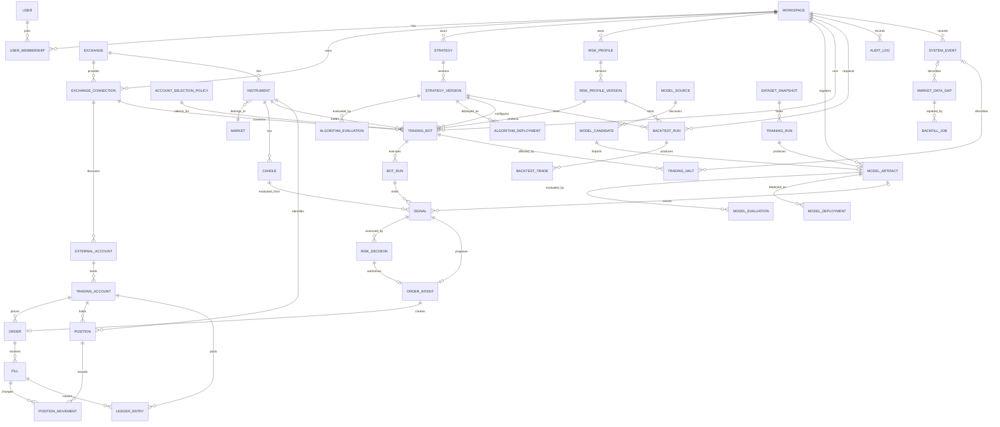

# ER図とデータ定義

## 1. 方針

- PostgreSQLを正本とする。
- 主キーはUUID。外部公開IDもUUIDを用いる。
- 金額・価格・数量は `numeric`。精度は銘柄メタデータで検証する。
- 全時刻は `timestamptz` でUTC保存する。
- 市場データは取引所・銘柄・時間足・開始時刻で一意にする。
- 注文、約定、ポジション、残高変化を分離する。
- 設定と戦略は変更せず新しい版を作る。
- 監査ログと台帳は追記専用にする。

## 2. 概念ER図

## 3. 中核テーブル

### テナント・認証

| テーブル | 主な列 | 制約・用途 |
|---|---|---|
| `workspace` | id, name, status, created_at | データ分離単位 |
| `user` | id, email, display_name, status | 認証主体。パスワード方式ならhashのみ |
| `user_membership` | workspace_id, user_id, role | 組合せ一意。roleはowner/operator/viewer |
| `audit_log` | id, workspace_id, actor_id, action, resource_type, resource_id, before_json, after_json, correlation_id, occurred_at | 追記専用 |

### 取引所・市場データ

| テーブル | 主な列 | 制約・用途 |
|---|---|---|
| `exchange` | id, code, name, status | `code` 一意 |
| `market` | id, code, asset_class, product_type, settlement_type | foreign_fx / crypto_fx、spot / margin / perpetual / futures等 |
| `exchange_connection` | id, workspace_id, exchange_id, label, mode, secret_ref, status, last_verified_at | 秘密値ではなく保管先参照を保存 |
| `external_account` | id, connection_id, external_account_ref, alias, environment, currency, hedging_enabled, margin_rate, mt4_account_ref, gslo_mode, capabilities_json, status, synced_at | OANDA等から検出した口座属性。外部IDは暗号化またはマスク表示 |
| `account_selection_policy` | id, workspace_id, name, version, criteria_json, status, created_by, created_at | 自動選択条件。不変版 |
| `instrument` | id, exchange_id, market_id, symbol, base_asset, quote_asset, contract_size, price_scale, quantity_scale, min_notional, margin_asset, status | `(exchange_id, market_id, symbol)` 一意 |
| `candle` | instrument_id, interval, open_time, close_time, open, high, low, close, volume, trade_count, source, quality_status, received_at | `(instrument_id, interval, open_time)` 一意。時系列パーティション候補 |
| `market_data_gap` | id, instrument_id, interval, from_time, to_time, status, detected_at, resolved_at | 欠損補完の追跡 |
| `backfill_job` | id, gap_id, requested_by, trigger_type, status, attempts, rows_written, validation_json, started_at, finished_at | 自動・手動補完の実行単位 |

### 戦略・リスク・実行

| テーブル | 主な列 | 制約・用途 |
|---|---|---|
| `strategy` | id, workspace_id, name, mode, status | modeはtechnical / ai_model |
| `strategy_version` | id, strategy_id, version, supported_market_types, definition_json, checksum, created_by, created_at | `(strategy_id, version)` 一意、更新不可 |
| `algorithm_evaluation` | id, strategy_version_id, evaluation_type, dataset_snapshot_id, metrics_json, risk_metrics_json, status, evaluated_at | static/backtest/walk_forward/paper |
| `algorithm_approval` | id, strategy_version_id, decision, approved_by, reason, expires_at, decided_at | live/paperの承認範囲を分離 |
| `algorithm_deployment` | id, strategy_version_id, bot_id, environment, status, deployed_by, deployed_at, rolled_back_from_id | 配備と切戻し |
| `risk_profile` | id, workspace_id, name, status | リスク設定の論理単位 |
| `risk_profile_version` | id, risk_profile_id, version, rules_json, checksum, created_at | 更新不可 |
| `model_artifact` | AI学習・モデル供給節で定義 | Botは承認済みの固定版だけを参照 |
| `trading_bot` | id, workspace_id, name, execution_mode, strategy_mode, connection_id, account_id, instrument_id, interval, strategy_version_id, risk_profile_version_id, desired_state, live_trading_enabled | execution_modeはpaper/live、strategy_modeはtechnical/ai_model |
| `bot_run` | id, bot_id, status, started_at, stopped_at, code_version, stop_reason, heartbeat_at | 実行単位 |
| `signal` | id, bot_run_id, candle_instrument_id, candle_interval, candle_open_time, strategy_version_id, model_artifact_id, action, score, rationale_json, input_checksum, created_at | 評価根拠。冪等キーを別途設定 |
| `risk_decision` | id, signal_id, risk_profile_version_id, outcome, rule_results_json, decided_at | allow/deny/allow_with_adjustment |
| `trading_halt` | id, workspace_id, scope_type, scope_id, level, reason_code, trigger_event_id, auto_releasable, release_condition_json, status, halted_at, released_at, released_by | 停止と解除を明示管理 |

### AI学習・モデル供給

| テーブル | 主な列 | 制約・用途 |
|---|---|---|
| `model_source` | id, name, provider_type, api_base_url, enabled, policy_json | 初期候補はHugging Face Hub。許可先だけ登録 |
| `model_candidate` | id, source_id, external_repo_id, revision, task, license_spdx, formats_json, metadata_json, discovered_at, review_status | 検索結果。実行物ではない |
| `dataset_snapshot` | id, workspace_id, instruments_json, intervals_json, from_time, to_time, feature_schema_json, row_count, quality_report_json, checksum, created_at | 学習入力の固定版 |
| `training_run` | id, workspace_id, dataset_snapshot_id, architecture, hyperparameters_json, seed, code_version, resource_limits_json, status, started_at, finished_at | アプリ内学習ジョブ |
| `model_artifact` | id, workspace_id, training_run_id, candidate_id, name, version, artifact_uri, format, checksum, feature_schema_json, status | 内製・外部を統一登録 |
| `model_evaluation` | id, model_artifact_id, dataset_snapshot_id, evaluation_type, metrics_json, trading_metrics_json, leakage_checks_json, status, evaluated_at | backtest/paper/holdout評価 |
| `model_security_review` | id, model_candidate_id, revision, license_result, format_result, malware_result, remote_code_result, checksum_result, status, reviewed_at | 外部モデル審査 |
| `model_deployment` | id, model_artifact_id, bot_id, environment, status, approved_by, approved_at, deployed_at, retired_at | Botへの適用と承認 |

### イベント・運用

| テーブル | 主な列 | 制約・用途 |
|---|---|---|
| `system_event` | id, workspace_id, occurred_at, severity, category, event_type, reason_code, source_type, source_id, target_type, target_id, correlation_id, message, payload_json | 運用イベント。秘密除去済み |
| `notification` | id, workspace_id, event_id, channel, status, recipient_ref, created_at, acknowledged_at, acknowledged_by | 重大イベント通知と確認状態 |

`system_event` は、利用者の変更操作を証明する `audit_log` と分ける。監査ログは「誰が何を変えたか」、イベントログは「システム内で何が起きたか」を記録する。

`signal` から `candle` への参照は複合外部キー、または `candle.id` を追加して単一外部キーにする。実装容易性を優先する場合は `candle.id` を採用し、業務一意制約も併設する。

### 口座・注文・台帳

| テーブル | 主な列 | 制約・用途 |
|---|---|---|
| `trading_account` | id, workspace_id, connection_id, external_account_id, mode, base_currency, selection_mode, selection_policy_id, status | paper/liveと手動/自動選択を明示 |
| `order_intent` | id, signal_id, risk_decision_id, side, order_type, requested_quantity, limit_price, stop_price, expires_at, created_at | 承認済み注文案 |
| `order` | id, account_id, order_intent_id, client_order_id, external_order_id, instrument_id, side, type, time_in_force, quantity, limit_price, stop_price, status, submitted_at, updated_at | `(account_id, client_order_id)` 一意 |
| `order_status_history` | id, order_id, from_status, to_status, reason_code, raw_ref, occurred_at | 状態遷移監査 |
| `fill` | id, order_id, external_fill_id, price, quantity, fee_amount, fee_asset, executed_at | 外部IDがある場合は取引所内一意 |
| `position` | id, account_id, instrument_id, side, quantity, average_entry_price, realized_pnl, status, version, updated_at | `(account_id, instrument_id, side, status=open)` の重複を禁止 |
| `position_movement` | id, position_id, fill_id, quantity_delta, realized_pnl_delta, occurred_at | 約定による変化を追記 |
| `ledger_entry` | id, account_id, transaction_id, asset, amount, entry_type, fill_id, occurred_at | 追記専用。transaction単位で資産変化を説明 |
| `account_snapshot` | id, account_id, captured_at, balances_json, equity, unrealized_pnl, source | 状態表示・照合用 |

## 4. 重要制約

- `high >= greatest(open, close, low)` かつ `low <= least(open, close, high)`。
- 価格、数量、手数料は原則0以上。台帳金額は増減を表すため符号を許可する。
- `close_time > open_time`。
- `paper` 口座から外部注文を送信してはならない。
- `live` 注文には、環境・workspace・Botのlive許可とOwner承認記録が必要。
- filled数量は注文数量を超えない。
- 注文状態の後退を禁止する。ただし照合訂正は専用イベントとして記録する。
- `strategy_version` と `risk_profile_version` は使用開始後に更新しない。
- `ledger_entry`、`fill`、`audit_log` は物理削除しない。

## 5. インデックス

- `candle(instrument_id, interval, open_time desc)`
- `signal(bot_run_id, created_at desc)`
- `order(account_id, status, updated_at desc)`
- `fill(order_id, executed_at)`
- `position(account_id, status)`
- `ledger_entry(account_id, occurred_at desc)`
- `bot_run(bot_id, started_at desc)`
- `audit_log(workspace_id, occurred_at desc)`
- `system_event(workspace_id, occurred_at desc)`
- `system_event(correlation_id, occurred_at)`
- `market_data_gap(instrument_id, interval, status)`
- `trading_halt(workspace_id, status, scope_type)`
- `model_candidate(source_id, external_repo_id, revision)` を一意化
- `training_run(workspace_id, status, created_at desc)`
- `model_evaluation(model_artifact_id, evaluation_type, evaluated_at desc)`
- `external_account(connection_id, external_account_ref)` を一意化
- `algorithm_evaluation(strategy_version_id, evaluation_type, evaluated_at desc)`
- `algorithm_deployment(bot_id, deployed_at desc)`

## 6. 保持・削除

- 監査ログ、注文、約定、台帳: 最低7年を初期案とし、利用形態・法域により確定する。
- 1分足: オンライン2年、その後圧縮またはオブジェクトストレージ。
- ティックデータを保存する場合: オンライン30〜90日を初期案とする。
- APIの生レスポンス: 秘密値を除去し、障害調査に必要な短期間のみ保持する。
- 利用者削除時も金融・監査記録は匿名化と法定保持を優先する。
