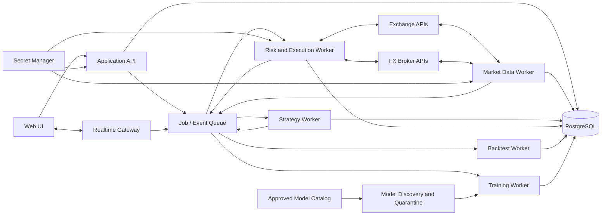
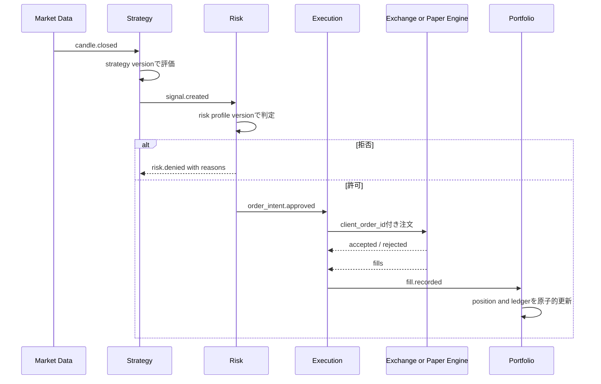

# アーキテクチャと移行計画

## 1. 推奨構成

MVPでは運用負荷を抑えるため「モジュラーモノリス＋独立ワーカー」を採用する。最初から多数のマイクロサービスへ分割しないが、注文執行と市場データ取得はWebプロセスから分離する。

## 2. モジュール境界

| モジュール | 責務 | 禁止事項 |
|---|---|---|
| Identity | 認証、workspace、権限 | 取引判断を持たない |
| Market Data | 取得、正規化、足生成、欠損補完 | 注文を出さない |
| Strategy | 確定データからシグナル生成 | 残高を直接変更しない |
| Risk | 注文前判定、停止ポリシー | 取引所SDKを直接呼ばない |
| Algorithm Governance | 定義、検証、評価、承認、配備、切戻し | 稼働版を直接変更しない |
| Execution | 注文状態機械、取引所照合、paper約定 | 戦略指標を計算しない |
| Portfolio | 残高、ポジション、損益、台帳 | 外部状態を無検証で上書きしない |
| Backtest | 履歴上の決定論的シミュレーション | ライブ口座へ接続しない |
| Model Lab | データスナップショット、学習、探索、隔離検査、評価、配備 | 未承認モデルを取引ワーカーでロードしない |
| Operations | ヘルス、通知、監査 | 秘密値をログへ出さない |
| Event Log | 構造化イベント、相関、通知、確認状態 | 監査ログの代替にしない |

複数市場は単一の巨大ループで処理せず、接続・口座・Botごとに独立した実行コンテキストを持つ。一つの取引所のレート制限や認証障害を他市場へ伝播させない。workspace全体の損失上限など、明示されたポートフォリオルールだけが横断停止を行う。

## 3. 注文処理フロー

イベント配送は少なくとも一回を前提にし、消費側を冪等にする。DB更新とイベント発行にはoutboxパターンを使い、「DBには注文があるがワーカーへ通知されない」状態を避ける。

## 4. 技術選定の初期案

| 領域 | 初期案 | 理由 |
|---|---|---|
| Backend | Python 3.13 + FastAPI | 型付きAPI、OpenAPI、非同期I/O、WebSocket、AI/Python資産との統合 |
| Domain/ORM | SQLAlchemy 2 + Alembic | 明示的トランザクションと移行管理 |
| DB | PostgreSQL | 同時実行、制約、JSON、時系列拡張性 |
| Queue | Redis StreamsまたはPostgreSQLベースのジョブキュー | MVPの運用容易性を優先 |
| Frontend | React + TypeScript | 状態管理とリアルタイムUIを型安全に実装 |
| Chart | 軽量チャートライブラリを比較選定 | ライセンスを事前確認 |
| Auth | OIDC対応IdP | パスワード実装を自前化しない |
| Secret | 配備先のSecret Manager | DB・Git・ログへ秘密を置かない |
| Packaging | Docker Compose（MVP） | 開発・検証環境の再現性 |
| Model format | safetensors＋署名/checksum | 外部pickleと任意コード実行を禁止 |
| Model catalog | Hugging Face Hub APIを初期候補 | メタデータ検索APIと公開モデルが利用可能 |
| Notification | Gmail API + OAuth 2.0 | 通常パスワードを保持せず、将来providerを追加可能 |

具体的なライブラリは、採用時点で保守状況・ライセンス・脆弱性を再確認して決定する。

FastAPIは小規模専用として選ぶものではない。APIプロセスはHTTP/WebSocketと認証・検証に集中させ、市場データ、Bot、注文、バックテスト、学習は独立workerへ分離する。負荷増加時はAPI worker、取引worker、学習workerを個別に増やす。

## 5. 安全制御

- `LIVE_TRADING_ALLOWED=false` を環境既定値とする。
- paperとliveで別の取引所接続・口座・DBレコードを使う。
- live有効化にはOwnerの再認証、確認文、期限付き承認を要求する。
- Bot起動前にデータ鮮度、秘密、取引権限、時刻同期、口座照合を確認する。
- 緊急停止はAPI障害時にも実行できる運用手順を用意する。
- ログへAuthorization、Cookie、APIキー、外部SDK生レスポンスを出さない。
- 依存関係、コンテナ、秘密、SASTをCIで検査する。
- 学習ワーカーはCPU/GPU・メモリ・時間制限付きの別コンテナで動かす。
- 外部モデル取得ワーカーは取引資格情報や取引ネットワークへアクセスできない。
- `trust_remote_code=false` を固定し、safetensors以外を自動ロードしない。
- OANDA口座属性はAPI同期結果を正本とし、hedging/netting等をローカル設定で上書きしない。

### 取引停止マトリクス

| 原因 | 初期停止範囲 | 状態 | 新規建玉 | 決済 | 解除 |
|---|---|---|---|---|---|
| 必須足の欠損・データ遅延 | 該当Bot/銘柄 | entry_halted | 禁止 | 許可 | 補完・再検証後に自動可 |
| WebSocket切断 | 該当接続 | entry_halted | 禁止 | REST状態確認後のみ | 再接続・履歴補完後に自動可 |
| API認証失敗 | 該当接続 | all_trading_halted | 禁止 | 自動は禁止 | 再認証後に手動 |
| 日次損失・DD上限 | 口座またはBot | entry_halted | 禁止 | 許可 | 翌営業日またはOwner承認 |
| 証拠金危険水準 | 該当口座 | all_trading_halted | 禁止 | リスク低減のみ | 安全水準＋Owner承認 |
| アルゴリズム評価期限切れ | 該当Bot | entry_halted | 禁止 | 許可 | 再評価・再承認後 |
| 注文・台帳不整合 | 該当口座 | emergency_stopped | 禁止 | 手動手順のみ | 照合完了＋Owner承認 |
| APIキー漏えい疑い | 該当接続またはworkspace | emergency_stopped | 禁止 | 手動手順のみ | キー失効・再発行後にOwner承認 |
| AIモデル異常・ドリフト | 該当Bot | entry_halted | 禁止 | 許可 | 直前承認版への切戻し＋再評価 |
| 利用者の緊急停止 | 選択範囲 | emergency_stopped | 禁止 | 選択ポリシー | 手動のみ |

停止判定はイベントを作成し、`trading_halt` を発効させる。単なるログ出力だけで売買可否を決めない。

## 6. テスト戦略

1. Decimalによる数量・価格・手数料・損益の単体テスト
2. シグナル、リスク、注文の状態遷移プロパティテスト
3. 取引所アダプターの共通契約テスト
4. WebSocket切断、429、タイムアウト、部分約定の障害注入テスト
5. PostgreSQLを使う統合テスト
6. API認証・認可・冪等性テスト
7. バックテストの未来情報混入防止テスト
8. paperでの24時間以上のソークテスト
9. live機能は取引所sandbox/testnetと最小額で別途検証

## 7. 開発フェーズ

### Phase 0: 権利・セキュリティ整理

- 既存キーを失効・再発行
- 新しい空のリポジトリを作成
- 要件と権利分離方針を承認
- 依存ライセンス方針、寄与ルール、秘密スキャンを設定

### Phase 1: 観測専用

- 認証、workspace、画面からの取引所・ブローカー接続
- 市場データ取得、正規化、DB、チャート
- 外貨FX・仮想通貨FXの統合/切替ダッシュボード
- イベントログ、欠損検出・補完、データ品質とヘルス表示
- 注文機能は実装しない
- OANDA USD/JPYとBinance BTC/JPYの取引可否・注文能力をAPIから同期
- 認証情報未登録でもpending接続を作成でき、入力後に検証・口座同期する

### Phase 2: ペーパートレード

- 戦略版、リスク設定版、シグナル
- テクニカル指標モードとAIモデルモードの独立実行
- 永続ペーパー口座、注文、約定、ポジション、台帳
- Bot操作、監査、リアルタイム画面
- OANDA USD/JPY・Binance BTC/JPY spotの成行/指値シミュレーション
- 実市場のbid/ask・spread・filterを使い、外部注文を送らないpaper adapter

### Phase 3: バックテスト・比較

- 非同期バックテスト
- 再現性情報、指標、結果比較
- paper結果との乖離分析
- アプリ内学習、外部モデル候補探索、隔離審査、共通評価

### Phase 4: 実取引審査

- 法務・運用・セキュリティレビュー
- 取引所照合、部分約定、取消、障害復旧
- testnet、限定利用、段階的な金額上限

### Phase 5: 拡張

- 初期採用先以外のブローカー・取引所アダプター
- ニュース・MLモデル
- 複数銘柄と相関リスク

## 8. 旧システムからの移行

既存アプリを止めずに置換する必要がある場合も、コード・DBの直接移植は行わない。

1. 新システムを観測専用で並行稼働する。
2. 同じ市場期間についてデータ完全性だけを比較する。
3. 新仕様から独立に作成した戦略テストを通す。
4. 新ペーパーエンジンを最低2〜4週間運転する。
5. 注文重複、残高不一致、復旧、緊急停止を検証する。
6. 旧システムを読み取り専用化し、必要な記録だけをアーカイブする。
7. 旧APIキー、配備物、ログを安全に廃止する。

## 9. 実装開始条件

- 要件定義のD-01〜D-10が決定済み
- ER図とAPIのレビューが完了
- 脅威モデルと障害時運用手順が作成済み
- 新リポジトリとCIの権利・秘密・依存検査が有効
- MVP受入試験がテストケースとして登録済み

## 10. フロントエンド画面構成

| 画面 | 主な機能 |
|---|---|
| 統合ダッシュボード | 全市場のBot、損益、ポジション、停止、重大イベント |
| 市場ダッシュボード | 外貨FX/仮想通貨FX別の口座、チャート、証拠金、稼働状況 |
| 接続管理 | API登録ウィザード、権限検査、疎通、ローテーション、無効化 |
| Bot管理 | 作成、複製、起動停止、モード、銘柄、時間足、適用設定版 |
| OANDA口座管理 | 全v20口座同期、能力比較、手動選択、自動選択シミュレーション |
| テクニカル戦略 | 指標条件ビルダー、検証、版作成、バックテスト |
| AIモデル | モデル版、来歴、特徴量、評価指標、承認、適用先 |
| Model Lab | データ作成、学習ジョブ、外部候補検索、安全審査、比較、配備 |
| リスク・停止センター | リスク設定、現在の停止、理由、解除条件、承認 |
| データ品質 | 遅延、欠損範囲、補完ジョブ、検証結果 |
| 注文・ポジション | 注文状態、約定、建玉、損益、証拠金、台帳 |
| イベントログ | 重要度・カテゴリ・対象・相関ID検索、詳細、通知確認 |
| バックテスト | 条件指定、進捗、指標、取引、比較 |
| システム設定 | 利用者、権限、通知、保持期間、監査ログ |
