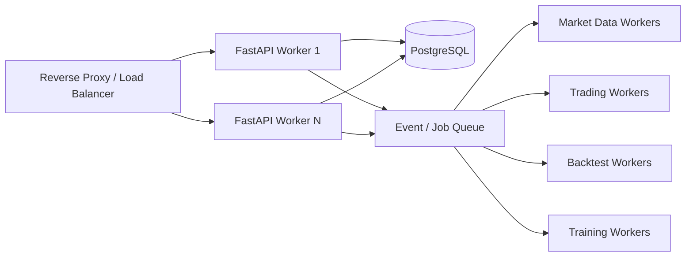

# 技術選定と開発構成

## 1. 採用構成

| 領域 | 採用 |
|---|---|
| Backend API | Python 3.13 + FastAPI |
| Frontend | React + TypeScript |
| Database | PostgreSQL 16+ |
| ORM/Migration | SQLAlchemy 2 + Alembic |
| Runtime | Docker Composeから開始 |
| Realtime | WebSocket gateway |
| Background jobs | 独立worker。queue製品は詳細設計で確定 |
| Authentication | OIDC対応provider |
| Secrets | 配備先Secret Manager |
| Email | Gmail API + OAuth 2.0 |
| ML | PyTorch系を初期候補、safetensors/ONNXのみ登録可能 |

## 2. FastAPIを採用する理由

採用理由はアプリが小規模だからではない。本製品の主要負荷が次の性質を持つためである。

- OANDA、Binance、Gmail、モデルカタログ等への非同期I/O
- React向けの型付きREST API
- リアルタイム状態・イベントのWebSocket配信
- OpenAPIからの契約、ドキュメント、TypeScript client生成
- Pythonによるデータ処理・機械学習との境界共有
- API、取引、学習をprocess/container単位で分離しやすい

FastAPIプロセスは注文アルゴリズムや学習を直接実行しない。命令受付、認証、入力検証、読み取りAPI、WebSocket gatewayを担当する。

## 3. 規模拡大への対応



規模拡大時は、API、接続、Bot、学習を個別に増やす。単一FastAPI processへ機能を詰め込まないため、FastAPIの選択が処理規模の上限を決めるわけではない。

## 4. Djangoとの比較

Djangoは管理画面、ORM、ユーザー管理を一体で早く作る場合に強い。一方、本製品はAPI契約、WebSocket、外部APIの非同期I/O、独立worker、React frontendを中心とする。そのため初期推奨はFastAPIとする。

将来、運営者向け管理業務が大幅に増えても、React管理画面を拡張するか、別の管理サービスを追加できる。取引ドメインをDjango/FastAPI固有のmodelやviewへ直接埋め込まないことが重要である。

## 5. 推奨リポジトリ構成

```text
apps/
  api/                 FastAPI HTTP/WebSocket
  web/                 React/TypeScript
  market_worker/       OANDA/Binance market data
  trading_worker/      algorithm/risk/execution
  backtest_worker/     deterministic simulation
  training_worker/     model training/evaluation
packages/
  domain/              framework-independent business rules
  contracts/           API/event schemas
  adapters/            OANDA/Binance/Gmail/Hugging Face
  persistence/         SQLAlchemy repositories
infra/
  migrations/          Alembic
  docker/
  observability/
tests/
  unit/
  integration/
  contract/
  e2e/
docs/
  adr/
```

## 6. 開発環境

- `local`: fake/paper adapter、ローカルPostgreSQL、秘密なしで起動可能
- `dev`: 実市場データ、practice/test credentials、外部実注文禁止
- `paper`: 実市場データ、長時間paper検証、外部実注文禁止
- `live`: 別環境。初期リリースでは作成しないか完全無効化

実市場データをpaperで利用する場合も、market-data credentialとexecution permissionを分離する。paper workerには外部注文endpointを呼ぶnetwork capabilityを与えない。

## 7. Gmail通知

- Gmail APIのOAuth 2.0 server-side flowを使用する。
- refresh tokenはSecret Managerへ置く。
- DBには接続状態、Google accountのマスク表示、secret referenceだけを保存する。
- 通知はoutbox経由で送信し、取引トランザクションをメール送信待ちにしない。
- Gmail障害で取引を停止しない。ただし通知失敗イベントを残し、アプリ内通知を継続する。
- 将来はprovider interfaceの実装として他メール・Slack等を追加する。

## 8. PostgreSQL DDL

初版DDLは `postgresql_schema_v0.1.sql` に作成した。49テーブル、外部キー、主要CHECK、部分unique index、outbox、idempotencyを含む。

次工程では実際のPostgreSQL 16コンテナへ適用し、以下を行う。

1. PostgreSQL parserによる構文確認
2. Alembic initial migrationへの変換
3. seed data作成
4. constraint/integration test
5. RLSを採用するかADRで決定
