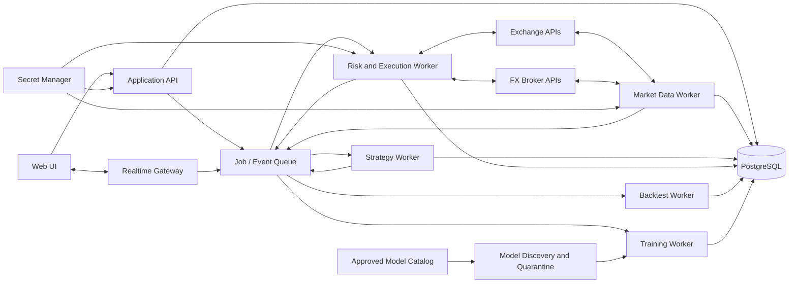
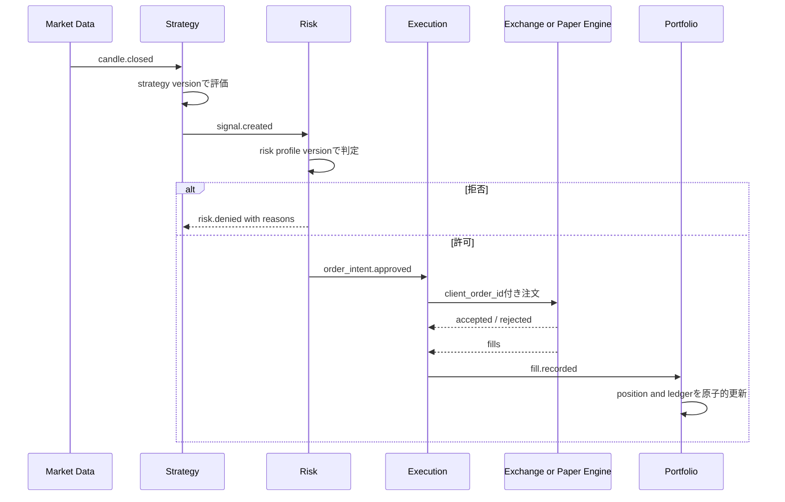

# アーキテクチャと移行計画

## 1. 推奨構成

MVPでは運用負荷を抑えるため「モジュラーモノリス＋独立ワーカー」を採用する。最初から多数のマイクロサービスへ分割しないが、注文執行と市場データ取得はWebプロセスから分離する。

## 2. モジュール境界

| モジュール | 責務 | 禁止事項 |
|---|---|---|
| Identity | 認証、workspace、権限 | 取引判断を持たない |
| Market Data | 取得、正規化、足生成、欠損補完 | 注文を出さない |
| Strategy | 確定データからシグナル生成 | 残高を直接変更しない |
| Risk | 注文前判定、停止ポリシー | 取引所SDKを直接呼ばない |
| Algorithm Governance | 定義、検証、評価、承認、配備、切戻し | 稼働版を直接変更しない |
| Execution | 注文状態機械、取引所照合、paper約定 | 戦略指標を計算しない |
| Portfolio | 残高、ポジション、損益、台帳 | 外部状態を無検証で上書きしない |
| Backtest | 履歴上の決定論的シミュレーション | ライブ口座へ接続しない |
| Model Lab | データスナップショット、学習、探索、隔離検査、評価、配備 | 未承認モデルを取引ワーカーでロードしない |
| Operations | ヘルス、通知、監査 | 秘密値をログへ出さない |
| Event Log | 構造化イベント、相関、通知、確認状態 | 監査ログの代替にしない |

複数市場は単一の巨大ループで処理せず、接続・口座・Botごとに独立した実行コンテキストを持つ。一つの取引所のレート制限や認証障害を他市場へ伝播させない。workspace全体の損失上限など、明示されたポートフォリオルールだけが横断停止を行う。

## 3. 注文処理フロー

イベント配送は少なくとも一回を前提にし、消費側を冪等にする。DB更新とイベント発行にはoutboxパターンを使い、「DBには注文があるがワーカーへ通知されない」状態を避ける。

### 注文状態遷移表

2026-09-19追加、2026-09-20更新(実DB CHECK制約に合わせ9値に修正)。`01_要件定義.md`
FR-ORD-05の状態一覧(`pending→submitted→partially_filled→filled/cancelled/rejected/expired`、
7値)を対象に、許可される遷移とトリガーを整理したもの。

**2026-09-20訂正**: 実DBの`trade_order.status` CHECK制約
(`database/postgresql_schema_v0.1.sql`)を確認した結果、上記7値に加えて`cancel_pending`・
`unknown`の2値が定義されており、実際には9値であることが判明した(Paper Trading
データモデル実装時、`app/models/trading.py`のdocstringに記録)。以下はこの9値版に更新した
ものであり、7値時代の遷移(`pending→submitted→...`)自体は変更しない。

| From | To | トリガー |
|---|---|---|
| `pending` | `submitted` | リスク承認後、取引所またはpaper engineへ送信 |
| `pending` | `rejected` | 送信前の内部検証(取引所filter、口座権限、数量・価格制約等)に失敗 |
| `submitted` | `partially_filled` | 部分約定通知を受信 |
| `submitted` | `filled` | 全量約定通知を受信 |
| `submitted` | `cancelled` | 取消要求(`POST /orders/{id}/cancel`)が受理され、未約定分が取消された |
| `submitted` | `rejected` | 取引所またはpaper engineが注文を拒否 |
| `submitted` | `expired` | 有効期限(time_in_force・指値有効期限)に到達し未約定のまま失効 |
| `partially_filled` | `filled` | 残数量の約定通知を受信 |
| `partially_filled` | `cancelled` | 残数量に対する取消要求が受理された(既約定分はfillとして残る) |
| `partially_filled` | `expired` | 残数量が有効期限に到達し失効(既約定分はfillとして残る) |
| `filled` / `cancelled` / `rejected` / `expired` | (遷移なし) | 終端状態。通常の状態機械からの遷移は発生しない |
| `pending` / `submitted` / `partially_filled` | `cancel_pending` | **2026-09-20用途確定**(Horizon 3注文フロー実装時、利用者判断)。取消要求受理〜取引所側の取消確定までの中間状態。自前シミュレーション(`app/trading/application/order_flow.py`)は約定を同期的・即時に行うため、取消要求と約定が競合する時間的余地が無く、このモジュール自身が`cancel_pending`を設定することは無い。実取引所への非同期の取消要求(将来のlive注文実装)や、約定待ちの指値注文向けに予約された値 |
| `cancel_pending` | `cancelled` | **2026-09-20用途確定**。取消が取引所側で確定した場合の遷移 |
| `cancel_pending` | (元の状態) | **2026-09-20用途確定**。取消が取引所側で失敗・却下された場合、`cancel_pending`に遷移する前の状態(`pending`/`submitted`/`partially_filled`)へ戻る |
| `pending` / `submitted` / `partially_filled` / `cancel_pending` | `unknown` | **2026-09-20用途確定**(利用者判断)。worker/プロセスクラッシュ等で正常に状態遷移を完了できなかった場合のフォールバック値(Horizon 1の`backfill_job`における`worker_interrupted`相当の考え方)。`app/trading/application/order_flow.py`は単一DBトランザクション内で同期的に完結するため、このモジュール自身が`unknown`を設定することも無い。将来の非同期実行(実取引所連携のworker化)やFR-ORD-06照合処理向けに予約された値 |

許可されない遷移(明示):

- 終端状態(`filled`/`cancelled`/`rejected`/`expired`)から他の状態への遷移は一切ない
  (例: `filled`から`pending`へは戻れない)。
- `submitted`/`partially_filled`から`pending`への巻き戻しは無い。
- `unknown`から他の状態への自動遷移は規定しない(復旧は個別の手動・照合処理で行う)。

既存整合性: `03_ER図とデータ定義.md`§4「注文状態の後退を禁止する。ただし照合訂正は
専用イベントとして記録する。」と一致させ、上表(`cancel_pending`/`unknown`を除く7値部分)は
通常の遷移のみを示す。取引所側の実際の状態と内部状態が不一致の場合の訂正(FR-ORD-06の
定期照合による強制的な状態合わせ)は、この通常遷移表とは別の専用イベントとして扱うという
既存方針を変更しない。`unknown`はこの照合訂正の文脈で使われる。

現時点の実装(`app/trading/application/order_flow.py`、paper取引の自前約定シミュレーション)
は`cancel_pending`/`unknown`のいずれも設定しない。両者とも将来の非同期フロー(実取引所への
live発注・取消の往復、およびFR-ORD-06のクラッシュ復旧・照合処理)のために予約された値で
あり、現行コードは`pending`/`submitted`から直接`cancelled`または`filled`へ同期的に遷移する。

## 4. 技術選定の初期案

| 領域 | 初期案 | 理由 |
|---|---|---|
| Backend | Python 3.13 + FastAPI | 型付きAPI、OpenAPI、非同期I/O、WebSocket、AI/Python資産との統合 |
| Domain/ORM | SQLAlchemy 2 + Alembic | 明示的トランザクションと移行管理 |
| DB | PostgreSQL | 同時実行、制約、JSON、時系列拡張性 |
| Queue | Redis StreamsまたはPostgreSQLベースのジョブキュー | MVPの運用容易性を優先 |
| Frontend | React + TypeScript | 状態管理とリアルタイムUIを型安全に実装 |
| Chart | 軽量チャートライブラリを比較選定 | ライセンスを事前確認 |
| Auth | OIDC対応IdP | パスワード実装を自前化しない |
| Secret | 配備先のSecret Manager | DB・Git・ログへ秘密を置かない |
| Packaging | Docker Compose（MVP） | 開発・検証環境の再現性 |
| Model format | safetensors＋署名/checksum | 外部pickleと任意コード実行を禁止 |
| Model catalog | Hugging Face Hub APIを初期候補 | メタデータ検索APIと公開モデルが利用可能 |
| Notification | Gmail API + OAuth 2.0 | 通常パスワードを保持せず、将来providerを追加可能 |

具体的なライブラリは、採用時点で保守状況・ライセンス・脆弱性を再確認して決定する。

FastAPIは小規模専用として選ぶものではない。APIプロセスはHTTP/WebSocketと認証・検証に集中させ、市場データ、Bot、注文、バックテスト、学習は独立workerへ分離する。負荷増加時はAPI worker、取引worker、学習workerを個別に増やす。

## 5. 安全制御

- `LIVE_TRADING_ALLOWED=false` を環境既定値とする。
- paperとliveで別の取引所接続・口座・DBレコードを使う。
- live有効化にはOwnerの再認証、確認文、期限付き承認を要求する。
- Bot起動前にデータ鮮度、秘密、取引権限、時刻同期、口座照合を確認する。
- 緊急停止はAPI障害時にも実行できる運用手順を用意する。
- ログへAuthorization、Cookie、APIキー、外部SDK生レスポンスを出さない。
- 依存関係、コンテナ、秘密、SASTをCIで検査する。
- 学習ワーカーはCPU/GPU・メモリ・時間制限付きの別コンテナで動かす。
- 外部モデル取得ワーカーは取引資格情報や取引ネットワークへアクセスできない。
- `trust_remote_code=false` を固定し、safetensors以外を自動ロードしない。
- OANDA口座属性はAPI同期結果を正本とし、hedging/netting等をローカル設定で上書きしない。

### 取引停止マトリクス

| 原因 | 初期停止範囲 | 状態 | 新規建玉 | 決済 | 解除 |
|---|---|---|---|---|---|
| 必須足の欠損・データ遅延 | 該当Bot/銘柄 | entry_halted | 禁止 | 許可 | 補完・再検証後に自動可 |
| WebSocket切断 | 該当接続 | entry_halted | 禁止 | REST状態確認後のみ | 再接続・履歴補完後に自動可 |
| API認証失敗 | 該当接続 | all_trading_halted | 禁止 | 自動は禁止 | 再認証後に手動 |
| 日次損失・DD上限 | 口座またはBot | entry_halted | 禁止 | 許可 | 翌営業日またはOwner承認 |
| 証拠金危険水準 | 該当口座 | all_trading_halted | 禁止 | リスク低減のみ | 安全水準＋Owner承認 |
| アルゴリズム評価期限切れ | 該当Bot | entry_halted | 禁止 | 許可 | 再評価・再承認後 |
| 注文・台帳不整合 | 該当口座 | emergency_stopped | 禁止 | 手動手順のみ | 照合完了＋Owner承認 |
| APIキー漏えい疑い | 該当接続またはworkspace | emergency_stopped | 禁止 | 手動手順のみ | キー失効・再発行後にOwner承認 |
| AIモデル異常・ドリフト | 該当Bot | entry_halted | 禁止 | 許可 | 直前承認版への切戻し＋再評価 |
| 利用者の緊急停止 | 選択範囲 | emergency_stopped | 禁止 | 選択ポリシー | 手動のみ |

停止判定はイベントを作成し、`trading_halt` を発効させる。単なるログ出力だけで売買可否を決めない。

**2026-09-19承認・追記**: 上表「解除」列のうち、人が判断して行う解除操作(「Owner承認」と
明記されている行、および「再認証後に手動」「手動のみ」と記載されている行)は、
停止レベル・原因を問わずOwnerのみが実行できる。Operatorは緊急停止を発動できる
（`09_開発着手前チェックリスト.md`§8参照）が、いずれの解除も行えない。
「自動可」「翌営業日」等、システムまたは時限により自動的に解除される行はこの決定の
対象外(人による解除判断を伴わないため)であり、従来の記述のまま変更しない。

### 停止レベルの状態遷移表

2026-09-19追加、2026-09-19判断反映(2回)。FR-RISK-06〜11(`warning`/`entry_halted`/
`all_trading_halted`/`emergency_stopped`)と上記「取引停止マトリクス」を対象に、
レベル間の遷移を整理したもの。

**2026-09-19決定(利用者判断)**:

1. `warning`は`trading_halt`テーブルに記録する(`level=warning`の行を作る)。新規建玉・
   決済は制限しない、通知目的の記録。
2. 同一原因のレベル間エスカレーション/デエスカレーションは、新しい`trading_halt`行を
   追加するのではなく、**既存行の`level`を書き換える**ことで表現する(1つの原因につき
   `trading_halt`行は1つを維持する)。
3. `entry_halted`からの緩和は**段階的に`warning`を経由する**(原因解消時にまず`warning`へ
   緩和し、閾値から十分離れたことを再確認してから「停止なし」に戻す、二段階の安全弁)。
4. `all_trading_halted`からの緩和も決定3と同じ段階的原則に従う
   (`all_trading_halted`→`entry_halted`→`warning`→(停止なし)と一段ずつ緩和する)。
5. `emergency_stopped`の解除は例外として、段階的緩和を経由せず**直接「停止なし」に戻る**。
   これは緊急停止が人(Owner)による最終判断であり、他の停止レベルの自動的な段階緩和
   原則とは性質が異なるためであり、意図的な例外として確定した。

この決定により、当初のたたき台(原因ごとに新規行を追加する案、および一段階で直接解除する案)
は不採用となった。以下の遷移表はこの決定を反映したものであり、既存マトリクスの10行の
「原因→初期状態」対応そのものは変更しない(初回発効時のlevelは変わらない)。

| From(実効レベル) | To | トリガー | 備考 |
|---|---|---|---|
| (停止なし) | `warning` | 閾値への接近を検知(例: marginCallPercent 0.50) | `trading_halt`行を新規発効(`level=warning`)。新規建玉・決済は制限しない |
| `warning` | `entry_halted` | 閾値到達を検知 | 同一`trading_halt`行の`level`を書き換え |
| `entry_halted` | `all_trading_halted` | 原因の悪化を検知(例: データ遅延が証拠金危険水準に至る等) | 同一`trading_halt`行の`level`を書き換え(エスカレーション) |
| `all_trading_halted` | `emergency_stopped` | さらなる悪化を検知 | 同一`trading_halt`行の`level`を書き換え |
| `entry_halted` | `warning` | マトリクス「解除」列の条件を満たす(原因解消・自動可否/承認要否はマトリクス参照) | 一段階緩和。この後さらに閾値から十分離れたことを再確認してから次の遷移へ進む |
| `all_trading_halted` | `entry_halted` | マトリクス「解除」列の条件を満たす(部分的な原因解消。多くはOwner承認) | 同一`trading_halt`行の`level`を書き換え(デエスカレーション)。決定4によりentry_halted⇔warningと同じ段階的原則を適用 |
| `warning` | (停止なし) | 閾値から十分離れたことを再確認 | `trading_halt`行を解除。緩和経路(`entry_halted`から)・新規発効の巻き戻し(そのまま`warning`が解消)経路の両方で共通 |
| `emergency_stopped` | (停止なし) | Owner解除(2026-09-19承認済み、Risk Gate項目6) | Operatorは解除不可。決定5により、`entry_halted`/`all_trading_halted`とは異なり段階的緩和を経由しない意図的な例外として直接解除する |

複数の`trading_halt`が同一スコープ(Bot/口座等)に同時に有効な場合、実効的な制限は
**最も重いレベルを優先する**(例: `entry_halted`と`all_trading_halted`が同時に有効なら
`all_trading_halted`の制限が適用される)。個々の`trading_halt`は自身の解除条件に従って
独立に解除され、他の`trading_halt`が残っていればその制限は継続する。

### `trading_halt.status`の状態遷移表(2026-09-20追加・案・未実装)

Paper Tradingデータモデル実装(`app/models/strategy.py`)時に判明した事実として、
`trading_halt`テーブルには上記「停止レベル(`level`)」とは**別の列`status`**
(`active`/`release_pending`/`released`、既定値`active`)が実DBに存在する。これは
上記「停止レベルの状態遷移表」が対象としていない、独立した状態機械である。

現時点でこの列を読み書きするアプリケーションコードは存在しない(2026-09-20時点で確認)。
そのため以下は実DBのCHECK制約から導出できる範囲の**たたき台**であり、実際にどの遷移を
使うか(特に`release_pending`を経由するかどうか)は未実装・未決定である。

実DBのCHECK制約(`ck_trading_halt_release`)が規定する事実のみ:
`status <> 'released'`のとき`released_at`は`NULL`でなければならず、`status = 'released'`
のときは`released_at`が`NOT NULL`でなければならない。つまり`released_at`が記録されるのは
`status`が`released`になった時点のみであり、`release_pending`の間はまだ`released_at`は
記録されない。

| From | To | トリガー(推測、未実装) |
|---|---|---|
| (存在しない) | `active` | `trading_halt`行の新規発効(上記「停止レベルの状態遷移表」の各発効イベントと同時に、既定値として設定される) |
| `active` | `release_pending` | 解除申請を受理したが、まだ解除は確定していない状態と推測される(制約上`released_at`はまだ`NULL`のままで良い)。申請の主体・条件を規定するコードは無い |
| `release_pending` | `released` | 解除が確定執行される。`released_at`・`released_by`が記録される(制約上必須) |
| `active` | `released` | `release_pending`を経由しない直接解除も、CHECK制約上は禁止されていない。どちらの経路を使うかは未実装のため両方を「制約上可能」として記載する |
| `release_pending` | `active` | 解除申請の取消(却下)も制約上は可能だが、これも未実装 |

`level`との関係(2026-09-20時点の整理):

- `level`と`status`は独立な列であり、一方の変更が他方を自動的に変化させる仕組みはコード上
  存在しない。
- 上記「停止レベルの状態遷移表」で「同一`trading_halt`行の`level`を書き換える」と記載した
  エスカレーション/デエスカレーション(`warning`⇔`entry_halted`⇔`all_trading_halted`)は、
  `level`列のみの変更であり、`status`は`active`のまま変化しないと推測される(この行は
  引き続き有効な停止として扱われる必要があるため)。
- 「`trading_halt`行を解除」「直接解除する」と記載した最終段階(`warning`→(停止なし)、
  `emergency_stopped`→(停止なし))が、`status`列の`released`への遷移に対応すると推測される。
  ただしこれが`release_pending`を経由するのか直接`released`にするのかは、上記の通り
  未確定。
- 特に`emergency_stopped`の解除について、「停止レベルの状態遷移表」の決定5は**`level`列**の
  遷移が段階的緩和を経由せず直接行われることのみを確定したものであり、`status`列が
  `release_pending`を経由するかどうかまでは決定していない。この点は今回の決定の対象外
  であり、実装時に別途確認が必要(Risk Gate項目6の「Owner解除」自体とは矛盾しない)。
- 実効的な取引制限(新規建玉・決済の可否)は引き続き`level`の値のみで決まる。`status`が
  `release_pending`であっても、`level`が緩和されない限り制限は継続する。

### 補完(Backfill/Gap-fill)の状態遷移表(2026-09-19・案・未承認)

`09_開発着手前チェックリスト.md`§6「Bot、注文、約定、停止、補完、モデルの状態遷移表を
作る」の「補完」に対応。concept文書のER図(`03_ER図とデータ定義.md`)ではなく、
**実装済みの`app/models/market_data.py`(`BackfillJob`/`MarketDataGap`)と
`app/market_data/infrastructure/leases.py`/`pages.py`の実コードから抽出した値**を基に
作成した(ドキュメント上の理想論ではない)。

**`BackfillJob.status`**(実装値: `queued`/`running`/`succeeded`/`failed`。`validating`は
下記の通り現行Workerでは新規に設定されないレガシー値):

| From | To | トリガー(コード上の根拠) |
|---|---|---|
| `queued` | `running` | Workerがleaseをclaimする(`leases.py:117-118`、`target.status == "queued"`のときのみ`running`へ) |
| `running` | `succeeded` | 要求範囲の最終ページまで取得しgap/coverage検証が完了(`pages.py:193`、`complete()`) |
| `running` | `queued` | リトライ可能な失敗かつ連続失敗3回未満(`pages.py:215`、`fail()`)。またはWorkerプロセスがlease有効期限内に完了報告できず、`recover_expired()`が連続失敗3回未満と判定(`leases.py:211`) |
| `running` | `failed` | リトライ不可な失敗、または連続失敗3回以上に達した(`pages.py:215`、`leases.py:211`。いずれも同じ`error_code="worker_interrupted"`等の分類を使う) |

`succeeded`/`failed`はこの1行(1つのbackfill要求)にとって終端であり、そこから
再遷移することはない。同じ範囲を再取得する場合は新しい`BackfillJob`行が作成される
(`ensure_no_overlapping_backfill`による重複拒否の対象は、あくまで**同時に有効な**
重複要求であり、終了済みjobの再遷移ではない)。

`validating`は`app/market_data/infrastructure/leases.py:27`(`ACTIVE_JOBS`)と
`normalize.py`(`normalize_legacy_jobs`、Worker独立プロセス化=2026-08-31以前の旧方式が
残した`running`/`validating`状態の行を`queued`へ戻す一度限りの運用コマンド)にのみ
出現する。現行Workerの`claim()`/`complete()`/`fail()`経路が新たに`validating`を設定する
コードは無く、`complete()`は`running`から直接`succeeded`へ遷移する(内部的な
gap/coverage検証は`running`のまま完了時に同期的に行われ、別ステータスへは分離されて
いない)。したがって`validating`は**現行実装では到達しないレガシー専用の値**であり、
上表には含めていない。

**`MarketDataGap.status`**(実装値: `open`/`resolved`のみ):

| From | To | トリガー(コード上の根拠) |
|---|---|---|
| (存在しない) | `open` | 確定足のcoverage再検証で内部欠損を検出し新規作成(`app/services/market_data.py:252-263`) |
| `open` | `resolved` | 同じ範囲の再検証で欠損が解消したと判定(`market_data.py:244`、`_gap_is_filled`) |

`resolved`から`open`への再遷移は無い。同じ時間範囲が再度欠損として検出された場合は
新しい`MarketDataGap`行が作成される(`market_data.py:246-263`のロジック上、
`status=="open"`の既存行のみを`existing_by_key`として扱うため)。

### 約定(Fill)の状態遷移表 — 調査結果: 対象外と判断

`03_ER図とデータ定義.md`の`fill`テーブル定義(`id, order_id, external_fill_id, price,
quantity, fee_amount, fee_asset, executed_at`)を確認したが、**`status`列そのものが
存在しない**。同§1「監査ログと台帳は追記専用にする」、§4「`ledger_entry`、`fill`、
`audit_log`は物理削除しない」という設計方針とも一致し、`fill`は「約定が発生したという
不変の事実の記録」として設計されており、それ自体が遷移するstateを持たない
append-onlyエンティティである。

「約定」に関する状態遷移は、既存の「注文状態遷移表」の`submitted→partially_filled→filled`
という遷移がその実体をカバーしている(FR-ORD-03「注文、約定、手数料、ポジション、残高を
別々に記録する」の「別々に記録する」は物理的なテーブル分離を指し、`fill`自体に別個の
stateを要求するものではないと解釈した)。

FR-ORD-06の「外部取引所の状態と内部状態を定期照合し、不一致をアラートする」という照合
要件は、`order`の状態(内部`status`と取引所実際の状態の一致)を対象にしたものであり、
個々の`fill`レコードそのものに「未照合/照合済み」等のstateを持たせる設計ではないと
判断した(該当する列・記述が無い)。

以上の根拠により、**約定(Fill)専用の状態遷移表は作成しない**。この判断が誤りで、
何らかの理由で`fill`に別途状態管理が必要という認識であれば、報告をお願いします。

### モデルの状態遷移表

2026-09-19決定(利用者判断): `09_開発着手前チェックリスト.md`§6「モデル」は
**`StrategyVersion`のライフサイクル**(前回報告した候補(a))を指すと確定した。
`ModelArtifact`/`ModelDeployment`(Horizon 6 AI Model Lab固有、候補(b))は対象外であり、
Horizon 6は前回までの棚卸しの通り開始条件未達・未着手のまま変更しない。

Botが実行する戦略のライフサイクルは`08_取引アルゴリズムとリスク初期値.md`§3
(`draft→validated→backtested→walk_forward_passed→paper_approved→live_approved→
deployed→suspended/retired`)を正とする。同§3には既に明示的な遷移図があるため、
本書では重複作成しない。`strategy_mode`が`technical`/`ai_model`いずれの場合も共通の
ライフサイクルとして定義されている(FR-ST-01)。

**2026-09-20訂正**: 以前の「補足」(直下に取り消し線で残す)は誤りだったため訂正する。
Paper Tradingデータモデル実装(`app/models/strategy.py`)時に実DBを確認した結果、
`strategy_version`テーブルには`status`という列名ではなく**`lifecycle_status`**という
列名で、単一列の状態機械が実在することが判明した。CHECK制約の値は`draft`/`validated`/
`backtested`/`walk_forward_passed`/`paper_approved`/`live_approved`/`suspended`/
`retired`の**8値**であり、`08_...md`§3が図示する`deployed`は**含まれていない**
(`08_取引アルゴリズムとリスク初期値.md`側にも同日付で訂正を追記した)。
`algorithm_evaluation.status`/`algorithm_approval.decision`/`algorithm_deployment.status`は
`lifecycle_status`とは別に存在する関連テーブルであり、それぞれ個々の評価結果・承認決定・
配備実行結果を保持するもので、`lifecycle_status`を代替するものではない。

~~補足(前回調査結果を維持): `strategy_version`テーブル自体には`status`列が無く、この
ライフサイクルは`algorithm_evaluation.status`/`algorithm_approval.decision`/
`algorithm_deployment.status`という複数の関連テーブルの組み合わせで表現される概念的な
遷移図であり、単一列の状態機械ではない。~~(2026-09-20: 上記の通り誤りと判明したため撤回)

### `risk_profile_version.status`の状態遷移表(2026-09-20追加・案・未実装)

`09_開発着手前チェックリスト.md`§6に対応する状態遷移表の対象一覧(Bot/注文/約定/停止/
補完/モデル)には含まれていなかったが、Paper Tradingデータモデル実装時に
`risk_profile_version.status`(`draft`/`approved`/`retired`、既定値`draft`)についても
承認済みの状態遷移表が存在しないことが判明したため、今回新規に作成する。

現時点でこの列を読み書きするアプリケーションコードは存在せず(2026-09-20時点で確認)、
`strategy_version.lifecycle_status`のような専用の関連テーブル(`algorithm_evaluation`等)も
`risk_profile_version`には存在しない。そのため以下は実DBのCHECK制約と、`risk_profile`
テーブルの`status`(`active`/`retired`)や`strategy_version.lifecycle_status`との類推から
組み立てた**たたき台**であり、承認済みではない。

| From | To | トリガー(推測、未実装) |
|---|---|---|
| (存在しない) | `draft` | `risk_profile_version`行の新規作成(既定値) |
| `draft` | `approved` | 承認操作(承認者・承認条件を規定するコードは無い) |
| `approved` | `retired` | 新しいバージョンの承認、またはリスクプロファイル自体の`retired`化に伴う退役 |
| `draft` | `retired` | 承認されなかった草案の廃止(実装未確認) |

`03_ER図とデータ定義.md`§1「`strategy_version`と`risk_profile_version`は使用開始後に
更新しない」という不変性の方針と一致させ、上表はいずれも新しい版の作成を伴う遷移として
扱う(既存行の`rules`・`checksum`を書き換えることはない)。`trading_bot.risk_profile_version_id`
がどの`status`の版を参照可能とすべきか(例: `draft`版をBotに適用してよいか)は、
`strategy_version.lifecycle_status`の`live_approved`のような明確な運用ゲートが
`risk_profile_version`側には存在しないため、別途要確認とする。

### Botの状態遷移表

2026-09-19追加。`04_API再設計.md`の`desired_state`/`actual_state`フィールドと
`POST /bots/{id}/commands`(`start`/`stop`/`pause`/`resume`)を対象に、遷移を整理した
たたき台。`desired_state`は利用者が意図する状態、`actual_state`はWorkerが実際に反映した
状態であり、両者は一時的に不一致になり得る(例: `desired_state=running`だが
`actual_state=starting`)。

`desired_state`の値(案): `stopped` / `running` / `paused`
`actual_state`の値(案): `stopped` / `starting` / `running` / `pausing` / `paused` /
`stopping` / `error`

| Command | 許可される現在の`desired_state` | 遷移後`desired_state` | 備考 |
|---|---|---|---|
| `start` | `stopped`, `paused` | `running` | 既に`running`の場合: `409 Conflict`を返す(下記「2026-09-19決定」参照) |
| `pause` | `running` | `paused` | 既に`paused`の場合: `409 Conflict`を返す |
| `resume` | `paused` | `running` | 既に`running`の場合: `409 Conflict`を返す |
| `stop` | `running`, `paused` | `stopped` | 既に`stopped`の場合: `409 Conflict`を返す(`start`/`pause`/`resume`と同一の扱い、2026-09-19確定) |
| `emergency-stop` | 任意 | `stopped`相当(かつ`trading_halt`の`emergency_stopped`を発効) | 通常のstopとは別経路。解除はOwnerのみ(Risk Gate項目6) |

**2026-09-19決定(利用者判断、確定)**: 目的の状態に既に到達しているコマンド(例: `running`の
Botへの`start`、`paused`のBotへの`pause`、`running`のBotへの`resume`、`stopped`のBotへの
`stop`)は、いずれも**`409 Conflict`エラーを返し、状態は変化させない**。つまりAPI応答
としては明示的にエラーを返すが、内部的な状態遷移という観点では何も起こらない(no-op)。
「エラー応答を返しつつ内部的にはno-op」という組み合わせであり、4コマンドすべてに統一して
適用する。`04_API再設計.md`「操作APIは非同期受付とする」「Idempotency-Key」の記述
(リクエストの重複防止)とは別の関心事であり矛盾しない。

### Bot pause/resumeの動作仕様

2026-09-19追加、2026-09-19判断反映(2回)。判断が分かれていた点のうち、
「損失回避優先ロジックの実装上の具体化」を除く全点が利用者判断により確定した。

| 観点 | 内容(2026-09-19決定) |
|---|---|
| pause実行時の新規発注 | 停止する(新しいシグナル評価・新しい`order_intent`を作らない) |
| pause実行時の既存未約定注文 | **自動取消する**(`POST /orders/{id}/cancel`相当を内部的に発行) |
| stop実行時の既存未約定注文 | `pause`と同様に**自動取消する**(2026-09-19確定。`pause`/`stop`で統一) |
| pause実行時の既存保有ポジション | 保持する。exit条件(stop-loss/take-profit)の**監視・執行を継続し、損失回避方向(リスク低減となる決済)を最優先で実行を続ける**。新規建玉のみ停止する |
| pause中に届いたfill通知 | **受理**し、`Portfolio`(ポジション・台帳)を通常通り更新する |
| resume実行時の再開手順 | **Bot起動時と同じ事前確認(データ鮮度、秘密、取引権限、時刻同期、口座照合)を再実施**してから新規発注を再開する |
| pauseとstopの違い | `pause`は同一`bot_run`を維持したまま新規発注のみ停止する。`stop`は`bot_run`を終了する(`stopped_at`を記録、次回`start`で新しい`bot_run`を開始)。既存未約定注文の自動取消は`pause`/`stop`共通。既存保有ポジションはいずれも自動的には決済されず、exitの監視は継続する |

**整合性の補足**: 「既存未約定注文は自動取消する」という決定は、取引停止マトリクスに
おける`entry_halted`原因の多くが「決済: 許可」(＝既存ポジションの決済注文は許可)として
いる記述と矛盾しない。自動取消の対象は「新規建玉のための未約定注文」であり、ポジションを
減らす方向の決済注文を禁止するものではないため、既存方針との対立は無い。

**承認対象外として残る1点**: 「損失回避を優先する」の実装上の具体化(例: stop-loss価格に
到達したら通常のシグナル評価経路を経ずに即時決済するのか、通常のexit判定ロジックをそのまま
使うのか)は、上記の決定には含まれず、**次のPaper Trading実装設計で確定する**。この1点のみ
未確定・承認対象外であり、本節の他の内容とは区別する。

### 実DBスキーマとの差異一覧(2026-09-20集約)

Paper Tradingデータモデル実装(SQLAlchemyモデル + ORM層追加。マイグレーションは
新規作成せず、既存の実DBスキーマをそのまま正とする方針で実施)の過程で判明した、
本書・関連文書の記述と実DB(`database/postgresql_schema_v0.1.sql`、2026-08-16の
初回マイグレーションで適用済み、以降未変更)との差異を以下に集約する。個々の反映内容は
上記各節を参照。

| 差異 | 発見の経緯 | 反映内容 |
|---|---|---|
| `trade_order.status`は7値ではなく`cancel_pending`/`unknown`を含む9値 | `app/models/trading.py`実装時、実DBのCHECK制約を確認して発見 | 上記「注文状態遷移表」に2値を追加。用途はコード上に実装が無く不明のため「要確認」と明記(独断で仕様を策定しない) |
| `trading_halt.status`(`active`/`release_pending`/`released`)が`level`とは別に存在する | 同上。`TradingHalt`ORMクラス作成時に実DBの全列を確認して発見 | 上記に新規の状態遷移表を追加。`level`との関係(独立な列であること)を明記 |
| `strategy_version`の列名は`status`ではなく`lifecycle_status`。`deployed`はCHECK制約に未対応 | 同上。以前の調査(前回セッション)では誤って「status列が無い」と報告していたが、実DB確認により訂正 | 上記「モデルの状態遷移表」の誤った補足を取り消し線で残し訂正。`08_取引アルゴリズムとリスク初期値.md`§3にも同日付で反映 |
| `risk_profile_version.status`(`draft`/`approved`/`retired`)に対応する状態遷移表が無かった | 同上。`09_開発着手前チェックリスト.md`§6の対象一覧(Bot/注文/約定/停止/補完/モデル)に元々含まれていなかったことに気付いた | 上記に新規の状態遷移表(たたき台)を追加 |
| 48テーブル(Paper Trading関連含む)は「これから作る物理DDL初版」ではなく、2026-08-16の初回マイグレーションで既に実DBへ適用済みだった | 同上。`information_schema`を直接照会して全テーブルの存在を確認 | `09_開発着手前チェックリスト.md`§1・§6に反映 |

いずれの差異も、実DB側を変更する話ではなく(「実DBを正とする」という既存決定を維持する)、
文書側の記述を事実に合わせる訂正である。用途が不明な値(`cancel_pending`/`unknown`)や
未実装の状態機械(`trading_halt.status`/`risk_profile_version.status`)について、
新たな仕様を独断で策定することはしていない。

## 6. テスト戦略

1. Decimalによる数量・価格・手数料・損益の単体テスト
2. シグナル、リスク、注文の状態遷移プロパティテスト
3. 取引所アダプターの共通契約テスト
4. WebSocket切断、429、タイムアウト、部分約定の障害注入テスト
5. PostgreSQLを使う統合テスト
6. API認証・認可・冪等性テスト
7. バックテストの未来情報混入防止テスト
8. paperでの24時間以上のソークテスト
9. live機能は取引所sandbox/testnetと最小額で別途検証

## 7. 開発フェーズ

### Phase 0: 権利・セキュリティ整理

- 既存キーを失効・再発行
- 新しい空のリポジトリを作成
- 要件と権利分離方針を承認
- 依存ライセンス方針、寄与ルール、秘密スキャンを設定

### Phase 1: 観測専用

- 認証、workspace、画面からの取引所・ブローカー接続
- 市場データ取得、正規化、DB、チャート
- 外貨FX・仮想通貨FXの統合/切替ダッシュボード
- イベントログ、欠損検出・補完、データ品質とヘルス表示
- 注文機能は実装しない
- OANDA USD/JPYとBinance BTC/JPYの取引可否・注文能力をAPIから同期
- 認証情報未登録でもpending接続を作成でき、入力後に検証・口座同期する

### Phase 2: ペーパートレード

- 戦略版、リスク設定版、シグナル
- テクニカル指標モードとAIモデルモードの独立実行
- 永続ペーパー口座、注文、約定、ポジション、台帳
- Bot操作、監査、リアルタイム画面
- OANDA USD/JPY・Binance BTC/JPY spotの成行/指値シミュレーション
- 実市場のbid/ask・spread・filterを使い、外部注文を送らないpaper adapter

### Phase 3: バックテスト・比較

- 非同期バックテスト
- 再現性情報、指標、結果比較
- paper結果との乖離分析
- アプリ内学習、外部モデル候補探索、隔離審査、共通評価

### Phase 4: 実取引審査

- 法務・運用・セキュリティレビュー
- 取引所照合、部分約定、取消、障害復旧
- testnet、限定利用、段階的な金額上限

### Phase 5: 拡張

- 初期採用先以外のブローカー・取引所アダプター
- ニュース・MLモデル
- 複数銘柄と相関リスク

## 8. 旧システムからの移行

既存アプリを止めずに置換する必要がある場合も、コード・DBの直接移植は行わない。

1. 新システムを観測専用で並行稼働する。
2. 同じ市場期間についてデータ完全性だけを比較する。
3. 新仕様から独立に作成した戦略テストを通す。
4. 新ペーパーエンジンを最低2〜4週間運転する。
5. 注文重複、残高不一致、復旧、緊急停止を検証する。
6. 旧システムを読み取り専用化し、必要な記録だけをアーカイブする。
7. 旧APIキー、配備物、ログを安全に廃止する。

## 9. 実装開始条件

- 要件定義のD-01〜D-10が決定済み
- ER図とAPIのレビューが完了
- 脅威モデルと障害時運用手順が作成済み
- 新リポジトリとCIの権利・秘密・依存検査が有効
- MVP受入試験がテストケースとして登録済み

## 10. フロントエンド画面構成

| 画面 | 主な機能 |
|---|---|
| 統合ダッシュボード | 全市場のBot、損益、ポジション、停止、重大イベント |
| 市場ダッシュボード | 外貨FX/仮想通貨FX別の口座、チャート、証拠金、稼働状況 |
| 接続管理 | API登録ウィザード、権限検査、疎通、ローテーション、無効化 |
| Bot管理 | 作成、複製、起動停止、モード、銘柄、時間足、適用設定版 |
| OANDA口座管理 | 全v20口座同期、能力比較、手動選択、自動選択シミュレーション |
| テクニカル戦略 | 指標条件ビルダー、検証、版作成、バックテスト |
| AIモデル | モデル版、来歴、特徴量、評価指標、承認、適用先 |
| Model Lab | データ作成、学習ジョブ、外部候補検索、安全審査、比較、配備 |
| リスク・停止センター | リスク設定、現在の停止、理由、解除条件、承認 |
| データ品質 | 遅延、欠損範囲、補完ジョブ、検証結果 |
| 注文・ポジション | 注文状態、約定、建玉、損益、証拠金、台帳 |
| イベントログ | 重要度・カテゴリ・対象・相関ID検索、詳細、通知確認 |
| バックテスト | 条件指定、進捗、指標、取引、比較 |
| システム設定 | 利用者、権限、通知、保持期間、監査ログ |
