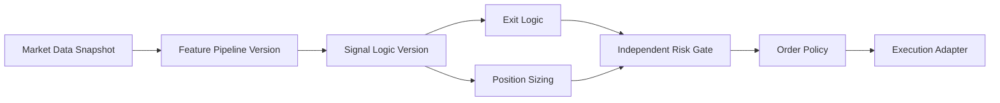

# 取引アルゴリズムとリスク初期値

## 1. 位置づけ

取引アルゴリズムは本製品の中核であり、単一のbuy/sell関数として扱わない。入力仕様、売買判断、数量計算、注文方式、リスク設定、検証結果、承認、配備を一つの追跡可能な版として管理する。

本書の数値は安全性を優先した製品初期値であり、収益を保証する投資助言ではない。ストップ注文もgap、slippage、市場停止により指定価格で約定する保証はない。

## 2. アルゴリズム構成



アルゴリズム版は以下を固定する。

- 対象市場、銘柄、時間足、取引セッション
- 必要履歴量とデータ品質条件
- technicalまたはai_modelの判断定義
- エントリーとエグジット条件
- ストップ、利確、トレーリング方式
- 数量計算方式
- MARKET/LIMITの選択規則と有効期間
- 最大spread/slippage
- リスクプロファイル版
- code、feature、modelの各version/checksum

## 3. 昇格ライフサイクル

```text
draft
 → validated
 → backtested
 → walk_forward_passed
 → paper_approved
 → live_approved
 → deployed
 → suspended / retired
```

**2026-09-20追記**: Paper Tradingデータモデル実装時に実DBを確認した結果、この
ライフサイクルを保持する列は`strategy_version`テーブルの**`lifecycle_status`**列
(`status`という列名ではない)であり、そのCHECK制約は`draft`/`validated`/`backtested`/
`walk_forward_passed`/`paper_approved`/`live_approved`/`suspended`/`retired`の**8値**
のみを許可する。上図の`deployed`は**現状のDB制約には含まれていない**(2026-08-16の
初回マイグレーション以降未変更)。`deployed`への対応(CHECK制約への追加、または
このライフサイクル上は`algorithm_deployment.status`側で表現し`lifecycle_status`には
`deployed`を持たせない設計に修正する、等)は未決定であり、
`05_アーキテクチャと移行計画.md`「モデルの状態遷移表」および
`09_開発着手前チェックリスト.md`に要確認事項として記録した。

- 各段階に最低データ量、最大DD、取引回数、安定性等の合格条件を設定する。
- テスト区間だけに過剰適合したパラメータを排除する。
- paperとliveの承認を分離する。
- live稼働中の自己書換え・自動再学習・無承認切替を禁止する。
- 異常時は新規建玉を停止し、直前承認版へ切戻す。未承認版への自動切替は行わない。

## 4. conservative-v1初期テンプレート

### 共通

| 項目 | 初期値 | ユーザー変更 | system hard limit初期案 |
|---|---:|---|---:|
| 1取引の想定最大損失 | equityの0.5% | 可 | 2.0% |
| 全open positionの想定損失合計 | equityの1.5% | 可 | 5.0% |
| 1日実現＋含み損失 | 日初equityの2.0%でentry_halted | 可 | 5.0% |
| 週間損失 | 週初equityの4.0%でentry_halted | 可 | 8.0% |
| peakからのdrawdown | 5.0%でentry_halted | 可 | 10.0% |
| 連続損失 | 3回でentry_halted | 可 | 7回 |
| 利益目標の最低reward/risk | 2.0 | 可 | 1.0未満はlive禁止 |
| 同一Botの新規注文間隔 | 15分 | 可 | 1分 |
| データ遅延 | 2本分でentry_halted | 可 | 5本分 |

OANDAの教育資料に1% risk ruleが紹介されていることを参考に、製品初期値はさらに安全側の0.5%とした。これは普遍的な最適値ではない。

### OANDA USD/JPY

| 項目 | 初期値 |
|---|---:|
| stop距離 | `max(ATR(14) × 1.5, current spread × 3, broker minimum distance)` |
| position size | stop約定時の想定損失がequityの0.5%以下となるunits |
| 実効レバレッジ上限 | 3倍 |
| marginCallPercent警戒 | 0.50でwarning、0.70でentry_halted |
| marginCloseoutPercent警戒 | 0.50でwarning、0.70でall_trading_halted |
| 金曜クローズ前 | 初期版は新規建玉停止。時間は口座地域・取引時間から設定 |
| 成行price bound | spread・短期volatilityから算出、固定pipsにしない |

OANDA API上、marginCallPercentおよびmarginCloseoutPercentは1.0以上で該当状態となるため、アプリはそれより手前で停止する。口座divisionや制度により条件が異なるため、固定のbrokerルールとしては扱わない。

### Binance BTC/JPY spot

| 項目 | 初期値 |
|---|---:|
| stop距離 | `max(ATR(14) × 2.0, current spread × 3)` |
| position size | stop約定時の想定損失がequityの0.5%以下、かつJPY残高の10%以下 |
| 1注文上限 | available JPYの10% |
| BTC総保有上限 | 口座equityの25%相当 |
| レバレッジ・借入・空売り | 禁止 |
| 指値有効期間 | 15分。期限後に再評価して取消 |

## 5. 数量計算

概念式:

```text
risk_budget = equity × risk_per_trade
stress_adjusted_stop = stop_distance + expected_slippage + fee_buffer
raw_quantity = risk_budget / stress_adjusted_stop
quantity = min(raw_quantity, exposure_limit, broker_limit)
```

最後に取引所のstep sizeへ安全側に切り捨てる。最小注文額を満たさない場合、リスク率を引き上げず注文を見送る。

### 5.1 `expected_slippage`・`fee_buffer`の初期値(案・未承認)

2026-09-19追加。§4のconservative-v1数値とは異なり、以下は**未承認のたたき台**であり、
`09_開発着手前チェックリスト.md`§8「gap/slippageを含むstress lossの計算条件を決める」に
対応する。実測の約定ログが無い段階での暫定値であり、承認・キャリブレーションが必要。

`stop_distance`自体が既にspread×3(OANDA)・spread×2.0相当(Binance、ATR(14)×2.0との
maxの一部)を含むため、ここでの`expected_slippage`・`fee_buffer`は**それとは別枠の
追加分**として設計する。同じspread要因を二重に積まないよう、係数は既存のstop距離計算
より小さい値を暫定採用した。

| 項目 | OANDA USD/JPY(案) | Binance BTC/JPY spot(案) |
|---|---:|---:|
| `fee_buffer` | 0(pips相当) | 想定約定金額 × 0.1% |
| `expected_slippage` | current spread × 0.5 | current spread × 1.0 |

根拠(いずれも未検証の暫定根拠であり、実測データによる見直しが前提):

- **OANDA `fee_buffer` = 0**: OANDA standard accountは別建ての取引手数料を課さず、
  コストはbid/askスプレッドに内包される。paper約定は実際のbid/askで約定させる設計
  (FR-ORD-16)のため、スプレッドコストは約定価格そのものに既に反映されており、
  ここで別途`fee_buffer`を積むと二重計上になる。
- **OANDA `expected_slippage` = spread × 0.5**: 既存のstop距離
  `max(ATR(14) × 1.5, current spread × 3, broker minimum distance)`は通常のstop約定
  余裕を確保するためのものであり、指標発表時のgapや急変時の追加滑りは別枠で保守的に
  見込む必要がある。実測データが無いため、平時のspreadの半分程度を暫定的な最小加算
  とした。
- **Binance `fee_buffer` = 想定約定金額 × 0.1%**: Binance spotの公開されている標準
  taker手数料(VIP割引・BNB割引適用前)を参考にした。実際のアカウントの手数料ティア・
  割引適用状況、およびBinance Testnetでの手数料仕様は未確認であり、別途確認が必要。
- **Binance `expected_slippage` = spread × 1.0**: Binance BTCJPYはOANDAの主要FXペアより
  板が薄い可能性を考慮し、OANDAより大きい係数を暫定的に採用した。実測データによる
  検証は未実施。

## 6. 画面変更ルール

- 初期テンプレート、現在版、編集案を並べて表示する。
- 値変更時に想定注文量、通常stop損失、stress loss、DD到達までの回数を再計算する。
- 安全性を強める変更と弱める変更を色・文言で区別する。
- hard limit内でも、弱める変更は理由入力、再認証、Owner承認を要求する。
- 保存は新バージョン作成のみ。稼働中版を更新しない。
- Bot停止後に新しい版を適用し、paperで再確認してからlive承認する。

## 7. OANDA口座選択

OANDA personal access tokenは複数sub-accountへアクセスできるため、接続時に全v20口座を同期する。

### 手動選択

ユーザーがpractice/live、通貨、hedging、margin、GSLO、MT4関連状態を比較し、Botに使用する口座を選ぶ。

### ポリシー選択

承認済みポリシー例:

```json
{
  "environment": "practice",
  "currency_preference": ["JPY", "USD"],
  "hedging_enabled": "any",
  "minimum_margin_available": "100000",
  "gslo_mode": ["REQUIRED", "ALLOWED", "DISABLED"],
  "tie_breaker": "highest_margin_available"
}
```

選択結果には、採用理由と他口座の除外理由を残す。条件を満たす口座がなければ選択を失敗させ、近い口座へ勝手にフォールバックしない。

### 能力差の扱い

- hedgingEnabled=falseでは反対注文のpositionFill動作を事前確認する。
- hedgingEnabled=trueでも、GSLOとhedged positionの組合せ制約をAPI能力・エラーから判定する。
- GSLOがREQUIREDなら保護注文なしの新規建玉を禁止する。
- MT4関連口座ではclientExtensions等のAPI制約を適用する。
- practiceとliveは別endpoint・別接続・別承認として扱う。
